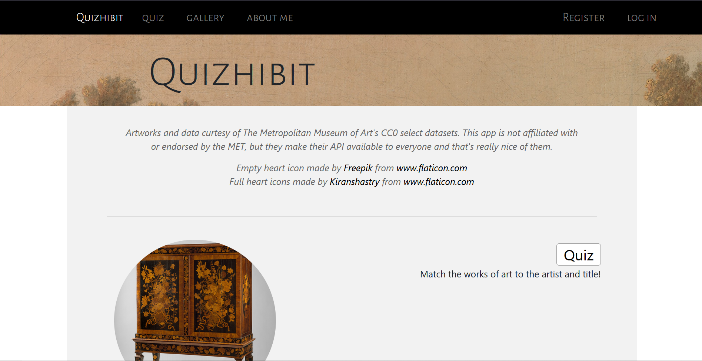
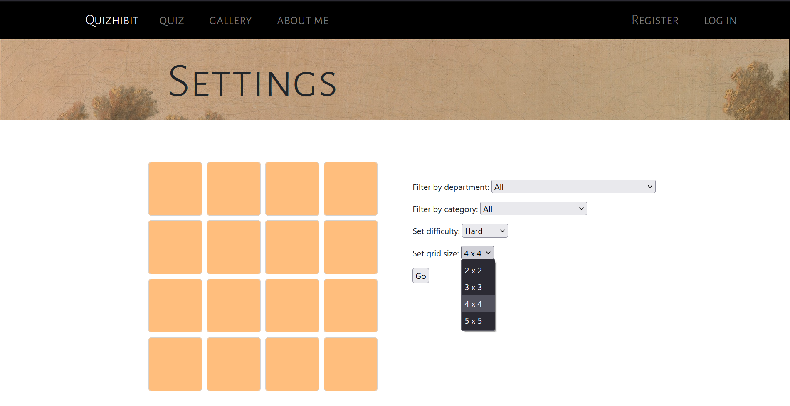
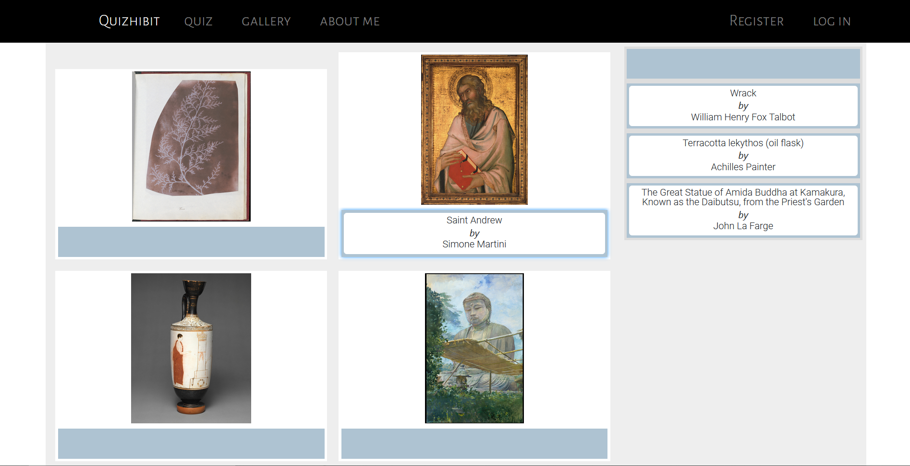
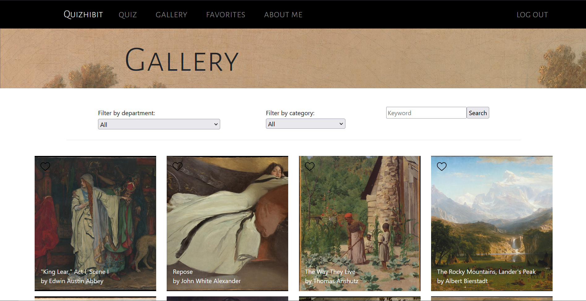
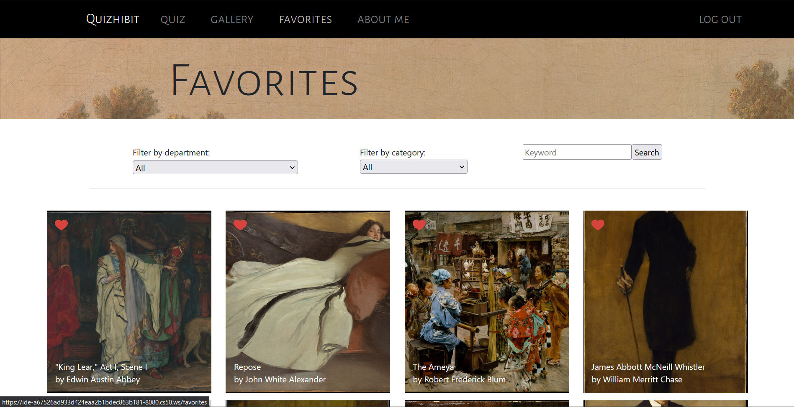

# Quizhibit

***

**This is my first web app and it is currently in active development. It's been deployed on Heroku for practice, but it's very buggy on there. 
The Metropolitan Museum API may change at anytime. Many feautres are still in progress.**

Quizhibit is an art quiz app, gallery browser, and search tool for the featured pieces in the Metropolitan Museum of Art. Registered users can
favorite pieces they like, quiz themselves on their favorites, and keep track of their average quiz score.


## Getting Started

A demo of the app can be viewed [here](https://quizhibit.herokuapp.com), although you will run into problems when signed into an account. 
Please do not use any personal information for the site, it is ***not*** secure. 
Your account may be deleted at any time, as I drop and reload the database regularly.

I believe the dependencies can be installed with:
```
pip install -r requirements.txt
```


## Files

### Procfile

This is for running the app on Heroku.

### app.py

app.py configures the web app and contains all the app's routes.
The app can be run from the project directory with:
```
flask run
```

### helpers.py

This file contains the helper functions for app.py. This includes some the login decorator, some SQL search functions, and function that helps
label an artwork as favorited or not.

### load.py

load.py will delete all databases and reload them. 
```
python load.py
```
It populates the databases from the Met API's csv and the API. Because the API limits requests to 80 per second, I had to add pauses in the program
and it takes several minutes to complete.

load.py also consolidates some of the sparser categories and reformats the data to be more readable.


### met.db 

The works table holds the artwork information, links to the images, and data on how often they've been guessed correctly in the quiz.
The users table holds usernames, hashed passwords, user id's, and quiz records. The favorites tables keeps track of the artwork id's and
user id's.


### requirements.txt

A list of the app's dependencies.

## Features

### Homepage

Welcomes the user when signed in and shows them their quiz average if they've taken at least one quiz. The artworks featured
on the homepage are chosen at random and change on every visit.



### Quiz

Quiz settings are previewed with a grid mock up that changes colors with difficulty. When signed in, the user can quiz themselves on their
favorites works of art.



Drag and drop the title of the artwork to the matching image.



You can favorite artwork from the results page.


### Gallery

You can browse, search, and favorites pieces from the gallery page.



### Favorites

Do the same on the favorites page, but with all of your most loved art pieces.



### Zoom

Click on any picture to see it in more detail!


